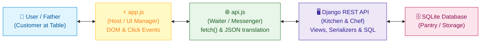
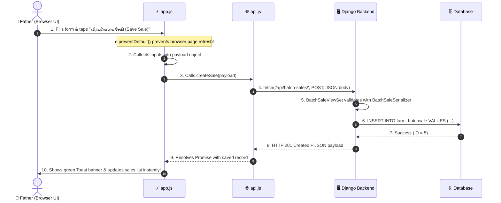

# 🐔 CoopOS: Day 4 — Frontend Architecture, SPA Controller & API Integration
**Date:** September 9, 2026  
**Phase:** Phase 2 (The Frontend Interface)  
**Tags:** #django #drf #javascript #architecture #blue-topaz #study-notes #coopos

---

> [!NOTE] 📱 Overview
> Today we brought CoopOS to life visually! We designed a mobile-first Single Page Application (SPA) based on our hand-drawn wireframe. We established a strict **Decoupled Client-Server Architecture** separating the Data Layer (`api.js`), the UI Controller (`app.js`), and the Backend ORM (`views.py`).

---

## 🏛️ Core Architecture: The Restaurant Analogy



### Separation of Responsibilities:
1. **`index.html` (The Skeleton):** Minimal HTML shell containing four view containers (`#view-dashboard`, `#view-sales`, `#view-expenses`, `#view-mortality`) and the mobile bottom navigation bar.
2. **`api.js` (The Service Layer / Courier):** Solely responsible for HTTP network calls (`fetch('/api/...')`). Converts JavaScript objects into JSON for outgoing requests, and unpacks incoming JSON into JavaScript objects. Zero HTML code.
3. **`app.js` (The UI Controller / Painter):** Listens to form submissions and tab switches. Calls `api.js` to fetch or send data, and dynamically renders cards and tables into the DOM.
4. **Django Backend (The Brain & Storage):** Serves the static HTML shell at root `/`, validates inputs via Serializers, executes database queries, and runs complex aggregations.

---

## 🔍 Deep-Dive: The `WeeklySales` `@action`

> [!QUESTION] ❓ The Big Realization
> *"My `BatchSale` model only has a `date = models.DateField()` column. I never designed a 'week' field in my database! How did Django fetch and group data weekly?"*

### 🧠 The Secret: Dynamic Database Calendar Math

In professional database design, **we never store what we can dynamically compute**. We used `TruncWeek` to push date math down to the database engine:

```python
@action(detail=True, methods=['get'])
def WeeklySales(self, request, pk=None):
    batch = self.get_object()
    weekly = batch.batchsale_set.annotate(
        week=TruncWeek('date')       # 1. Snaps any date to that week's Monday
    ).values('week').annotate(       # 2. SQL GROUP BY week
        sales_count=Count('id'),     # 3. Counts sales in this week bucket
        total_amount=Sum('amount')   # 4. Sums amounts in this week bucket
    ).order_by('week')               # 5. Chronological order

    return Response({
        'batch_no': batch.batch_no,
        'weekly_sales': list(weekly)
    })
```

### The Equivalent SQL Generated Under the Hood:
```sql
SELECT 
    DATE(date, 'weekday 0', '-6 days') AS week, 
    COUNT(id) AS sales_count, 
    SUM(amount) AS total_amount
FROM farm_batchsale
WHERE batch_id = 10
GROUP BY week
ORDER BY week ASC;
```

> [!TIP] 💡 Senior Interview Answer
> *"By combining `TruncWeek` with `.values('week')` and `.annotate()`, Django generates a SQL `GROUP BY` query. This allows the database to aggregate hundreds of rows in C and return only summary rows, keeping memory usage minimal."*

---

## 🔄 The Full Request-Response Lifecycle of a Button Click



---

## 🎯 Screen Wireframe Implementation

Based on our hand-drawn wireframe, all 4 mobile views are active:

| Screen | View ID | Features | API Endpoints Used |
|:---|:---|:---|:---|
| **1. Dashboard** | `#view-dashboard` | Total/Alive/Dead bird counts, Financials, Weekly breakdown, Net status | `GET /api/batches/`, `ProfitORLose/`, `Mortality_Rate/`, `WeeklySales/` |
| **2. Sales (விற்பனை)** | `#view-sales` | Dynamic Batch & Customer dropdowns, Hen/Rooster counts, Weight, Amount, Sales history | `POST /api/batch-sales/`, `GET /api/batch-sales/`, `GET /api/customer-details/` |
| **3. Expenses (செலவு)** | `#view-expenses` | Batch dropdown, Categories (Feed, Vaccines, Labor, etc.), Amount, Expense history | `POST /api/batch-expenses/`, `GET /api/batch-expenses/` |
| **4. Mortality (இறப்பு)** | `#view-mortality` | Batch dropdown, Date & Time, Death count, Reason dropdown, Death logs | `POST /api/mortality-rates/`, `GET /api/mortality-rates/` |

---

## 📦 Git Commits Log (Honest & Attributed)

```bash
5e75182 feat(frontend): add responsive mobile SPA interface (AI-assisted)
ff9b30b feat(backend): implement WeeklySales action and frontend URL routing
f0232d2 test: add automated APITestCase suite and realistic farm database seed script
```
- **Backend Routing, URL Configuration, and `WeeklySales` Logic:** Developed by **Ahas Raaj**.
- **Frontend HTML Shell & Tailwind Styling:** Generated with **AI assistance**.
- **Repository:** Up to date on `main` branch.
